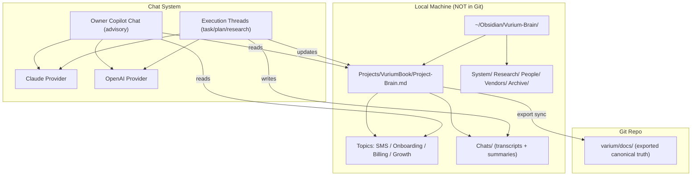

# Workspace Brain and Multi-Chat Plan

> [[Home]] > [[00-System/Obsidian-Knowledge-System|Obsidian Knowledge System]]
> Related: [[04-Tasks/Workflow-Queue|Workflow Queue]], [[AI-Profiles/AI-3-Verdent|AI-3 Verdent]], [[Tasks/SMS-Notifications-Brain|SMS Notifications Brain]]

## Purpose

Define the approved target architecture for the Vurium AI operating system so it behaves like:

- one central brain,
- one smart owner chat,
- multiple project chats,
- multiple AI providers in one place,
- full memory persistence in Obsidian,
- clean project separation,
- low GitHub noise.

This is the working blueprint for how the system should operate when it is correct, not just how the current transitional implementation behaves.

## Plan Comparison & Decisions

Three approaches were evaluated. These are the approved decisions.

| Question | Decision | Rationale |
|---|---|---|
| Code-first vs docs-first? | Docs-first | Brain structure must exist before code can read/write to it. This avoids building to a moving target. |
| Automated migration scripts vs manual? | Manual inventory + scripted export sync | The existing docs need human judgment for canonical vs superseded. Ongoing export to repo should still be repeatable. |
| All topic brains at once vs SMS only? | SMS first + 2-3 more in Phase 1 | SMS already has a working prototype. Onboarding and Billing are active enough to justify early topic brains too. |
| Backend brain module vs lightweight file ops? | Lightweight file ops first | The brain is Obsidian files, not a database. Avoid over-engineering. |
| Cross-vault linking? | Explicit path refs, not wiki links | Two separate Obsidian vaults cannot resolve cross-vault wiki links reliably. |

## 1. Target Architecture



Three layers:

1. Local Master Brain: `~/Obsidian/Vurium-Brain/`
   This is the full memory system, for all projects, all chats, and long-term knowledge. It is not fully committed to Git.
2. Per-Project Brain: `Projects/VuriumBook/`
   This is the single project hub with state, chats, tasks, research, and topic brains.
3. Repo Export: `varium/docs/`
   This contains only exported canonical project truth that should travel with the codebase.

## 2. Storage Model

### Local Master Brain Structure

```text
~/Obsidian/Vurium-Brain/
├── System/
│   ├── Brain-Operating-Rules.md
│   ├── Export-Rules.md
│   └── Templates/
├── Projects/
│   ├── VuriumBook/
│   └── <FutureProject>/
├── Research/
├── People/
├── Vendors/
└── Archive/
```

### VuriumBook Project Structure

```text
Projects/VuriumBook/
├── Project-Brain.md
├── Current-State.md
├── Execution-Checklist.md
├── Open-Questions.md
├── Decisions.md
├── Topics/
│   ├── SMS-Notifications-Brain.md
│   ├── Onboarding-Brain.md
│   ├── Billing-Brain.md
│   └── Growth-Brain.md
├── Chats/
│   ├── 2026-04-17-copilot-01.md
│   ├── 2026-04-17-claude-02.md
│   └── Thread-Memory/
│       ├── copilot-01-summary.md
│       └── claude-02-summary.md
├── Tasks/
├── Research/
├── Handoffs/
└── Deliverables/
```

### Export Rules (Brain -> Repo)

| What goes to repo `docs/` | What stays local only |
|---|---|
| Implementation plans | Chat transcripts |
| Product briefs | Thread summaries |
| Compliance requirements | Project-Brain.md / Current-State.md |
| Feature docs | Open-Questions.md |
| Runbooks | Decisions.md unless architectural |
| Task records relevant to codebase | Personal research |
| Decision log entries | Vendor contacts |

Sync mechanism:

- use manual or scripted copy of specific files,
- do not use a git submodule,
- do not use symlinks,
- use a simple export script such as `export-to-repo.sh` that copies selected canonical files from the local brain into repo `docs/`.

## 3. Chat Persistence Model

### Per-Thread Transcript

```markdown
---
type: chat-transcript
thread_id: copilot-01
project: VuriumBook
mode: advisory
provider: claude
created: 2026-04-17T12:00:00
updated: 2026-04-17T14:30:00
linked_tasks: []
linked_plans: []
---

# Copilot Thread 01 — 2026-04-17

## Messages

### 12:00 — Owner
що зараз блокує sms?

### 12:00 — Copilot (Claude)
Читаю SMS Brain... [response]

### 12:05 — Owner
починай планувати tfv

### 12:05 — Copilot -> Execution
Створюю задачу: [link to task]
```

### Per-Thread Summary (lightweight memory)

```markdown
---
type: thread-summary
thread_id: copilot-01
project: VuriumBook
---

# Thread Summary — copilot-01

- About: SMS reminder launch readiness
- Current issue: TFV plan v2 awaiting AI 1 + AI 4 review
- Last decision: Pattern B (Sole Proprietor) chosen
- Next step: Wait for review gate, then implementation
- Linked: [[TFV Implementation Plan v2]], [[SMS-Notifications-Brain]]
```

### Project-Level Memory Rollup

After each significant chat session, update:

- `Project-Brain.md`
- `Current-State.md`
- `Execution-Checklist.md`

from the chat summaries.

The system should read summaries first, not full transcripts. Full transcripts are reference and audit only.

## 4. Project / Thread / Topic Memory Model

### Read Order Per Message

```text
1. Project-Brain.md
2. Current-State.md
3. Topic Brain if relevant
4. Thread Summary
5. Full transcript only if explicitly needed
```

### Topic Brain Structure

Each topic brain should follow a standard schema:

```markdown
---
type: brain
status: active
topic: <topic-slug>
working_memory: true
---

# <Topic> Brain

## Current verdict
## Current source-of-truth stack
## What is already known
## What still blocks completion
## Current recommended execution path
## Immediate next action
## Recent operational thread
## Owner Copilot rule
```

### Thread to Brain Links

- Every chat thread links to its project brain.
- Every execution thread links to the topic brain it operates on.
- Topic brains link up to the project brain and sideways to related plans.
- Project brain is the single root node. Everything links back to it.

## 5. Migration Plan for Existing Docs

### Phase A — Inventory (AI 3 task)

Create:

- `~/Obsidian/Vurium-Brain/System/Migration-Inventory.md`

Then:

1. list all existing repo docs,
2. classify each as:
   - canonical
   - supporting
   - superseded
   - brain-only
   - archive
3. group by cluster:
   - SMS
   - Auth / Security
   - Growth
   - Compliance
   - System
   - DevLog
   - other major clusters.

### Phase B — Topic Brain Creation

For each major cluster, create a topic brain in the local vault that:

- links to all canonical notes in that cluster,
- provides the current verdict summary,
- becomes the entry point instead of scattered individual notes.

### Phase C — Re-linking

- Add `brain_link:` frontmatter to repo docs pointing to their topic brain.
- Add explicit path references, not cross-vault wiki links, between the brain vault and repo vault.
- Update `Home.md` to reference topic brains where they exist.

### Phase D — Cleanup

- Mark obviously dead or duplicate notes as `status: superseded`.
- Move raw chat dumps and low-value auto-generated queue items to Archive.
- Do not mass-delete.
- Do not mass-move during active launch work.

### Migration Order by Cluster

1. SMS / Notifications
2. System / Operating System
3. Compliance
4. Growth
5. Architecture / Backend / Frontend
6. DevLog

## 6. Implementation Phases

### Phase 1 — Brain Structure (no major code changes)

What to do:

- create `~/Obsidian/Vurium-Brain/` directory structure,
- create `VuriumBook/Project-Brain.md`,
- create `VuriumBook/Current-State.md`,
- create `VuriumBook/Execution-Checklist.md`,
- migrate `SMS-Notifications-Brain` into the local vault,
- create `Onboarding-Brain` and `Billing-Brain` stubs,
- create `System/Brain-Operating-Rules.md`,
- create `System/Export-Rules.md`,
- add brain templates to `docs/11-Reference/Templates/`.

Verification:

- Obsidian opens `~/Obsidian/Vurium-Brain/` as a vault,
- `Project-Brain.md` links to all major topics,
- graph view shows a connected project cluster instead of scattered nodes.

### Phase 2 — Chat Persistence

What to do:

- define chat transcript and thread summary templates,
- save each significant owner chat into `Chats/`,
- create thread summaries,
- update `Current-State.md` from the latest summaries,
- verify that Copilot reads `Project-Brain`, `Topic Brain`, and `Thread Summary` before answering.

Verification:

- Owner asks "what is going on with SMS?"
- system answers accurately using `SMS-Notifications-Brain` and latest thread memory without needing to reread everything.

### Phase 3 — Multi-Chat UI

What to do:

- support multiple named chat threads per project,
- support thread switching,
- show project and topic context in the thread header,
- save each thread to its own transcript file,
- keep all threads on the same project brain.

Verification:

- Owner can open `VuriumBook / Copilot` and `VuriumBook / Claude Planning` at the same time.
- Switching threads preserves context.
- New thread auto-links to the project brain.

### Phase 4 — Multi-Provider AI

What to do:

- add OpenAI alongside Claude in the same chat system,
- support direct tabs:
  - Copilot
  - Claude
  - OpenAI
- keep shared project memory underneath.

Verification:

- Owner can start one thread with OpenAI for product framing,
- another thread with Claude for backend planning,
- both still read the same `Project-Brain.md`.

### Phase 5 — Migration Cleanup

What to do:

- execute migration inventory,
- clean old notes cluster by cluster,
- reduce repo `docs/` to canonical-only,
- move non-canonical long-term memory to the local brain.

Verification:

- repo `docs/` becomes smaller and cleaner,
- no broken backlinks,
- local brain graph becomes project-centric and readable.

## 7. Exact First Build Steps for VuriumBook

These are the literal first build actions for the next implementation session.

### Step 1 — Create the local vault

```bash
mkdir -p ~/Obsidian/Vurium-Brain/{System,Projects/VuriumBook/{Topics,Chats/Thread-Memory,Tasks,Research,Handoffs,Deliverables,Decisions},Research,People,Vendors,Archive,Templates}
```

### Step 2 — Create Project-Brain.md

File:

- `~/Obsidian/Vurium-Brain/Projects/VuriumBook/Project-Brain.md`

Content source:

- current `docs/Tasks/In Progress.md`
- `docs/Tasks/3-AI-Remaining-Work-Split.md`
- active launch / completion notes

### Step 3 — Create Current-State.md

File:

- `~/Obsidian/Vurium-Brain/Projects/VuriumBook/Current-State.md`

Content source:

- active blockers,
- review gate status,
- owner tasks,
- sprint state.

### Step 4 — Migrate SMS Brain

Copy:

- `docs/Tasks/SMS-Notifications-Brain.md`

to:

- `~/Obsidian/Vurium-Brain/Projects/VuriumBook/Topics/SMS-Notifications-Brain.md`

Then update links to use explicit path references where the target lives in the repo.

### Step 5 — Create stub topic brains

Create:

- `Onboarding-Brain.md`
- `Billing-Brain.md`

in `Projects/VuriumBook/Topics/` using the same template as the SMS brain.

### Step 6 — Create Brain Operating Rules

File:

- `~/Obsidian/Vurium-Brain/System/Brain-Operating-Rules.md`

Should document:

- export rules,
- read order,
- topic brain template,
- chat persistence rules.

### Step 7 — Add brain templates to repo

Add to `docs/11-Reference/Templates/`:

- `Brain-Project-Brain-Template.md`
- `Brain-Topic-Brain-Template.md`
- `Brain-Chat-Transcript-Template.md`
- `Brain-Thread-Summary-Template.md`

### Step 8 — Record decision

Add a decision entry under `docs/10-Decisions/` with:

- Workspace Brain architecture adopted
- Local vault at `~/Obsidian/Vurium-Brain/`
- Repo `docs/` = exported canonical truth only
- Chat persistence = Obsidian files, not database

## Definition of Done for Phase 1

1. `~/Obsidian/Vurium-Brain/` exists and opens as an Obsidian vault.
2. `Project-Brain.md` exists with links to all active topics.
3. `Current-State.md` reflects actual sprint state.
4. `SMS-Notifications-Brain` is migrated to local vault.
5. At least two additional topic brain stubs exist.
6. Brain templates are added to `docs/11-Reference/Templates/`.
7. Decision is recorded in `docs/10-Decisions/`.
8. No mass-move of repo docs happened during Phase 1.

## Step -> Target -> Verification

| Step | Target | Verification |
|---|---|---|
| 1 | `~/Obsidian/Vurium-Brain/` directory tree | `ls` confirms all directories exist |
| 2 | `Projects/VuriumBook/Project-Brain.md` | Obsidian graph shows it as central node |
| 3 | `Projects/VuriumBook/Current-State.md` | Content matches active `In Progress` state |
| 4 | `Projects/VuriumBook/Topics/SMS-Notifications-Brain.md` | Migrated and readable in local vault |
| 5 | Onboarding + Billing brain stubs | follow the topic brain template |
| 6 | `System/Brain-Operating-Rules.md` | export rules and read order documented |
| 7 | `docs/11-Reference/Templates/Brain-*` | templates committed to repo |
| 8 | `docs/10-Decisions/` entry | decision recorded with rationale |

## Verdent Planning Prompt

Use this to start the detailed Verdent planning pass:

```text
You are Verdent (AI-3) inside the Vurium AI Operating System.

Use /Users/nazarii/Downloads/varium/docs/00-System/Workspace-Brain-and-Multi-Chat-Plan.md as the approved source of truth.

Plan the implementation of the Vurium workspace brain and multi-chat system.

Goals:
- local Obsidian brain outside the repo
- one Project Brain per project
- one Topic Brain per major workstream
- GPT-like owner copilot chat
- multiple project chat threads
- Claude + OpenAI integrated into one system
- full chat persistence into Obsidian
- low GitHub noise through export/sync rules
- migration of old disconnected notes into the new brain structure

Deliver:
1. target architecture
2. storage model
3. chat persistence model
4. project/thread/topic memory model
5. migration plan for old notes
6. implementation phases
7. exact first build steps for VuriumBook

Rules:
- keep Owner control
- keep AI-3 as planning/QA governor
- do not add unnecessary new roles
- optimize for practical execution, not theory
```
