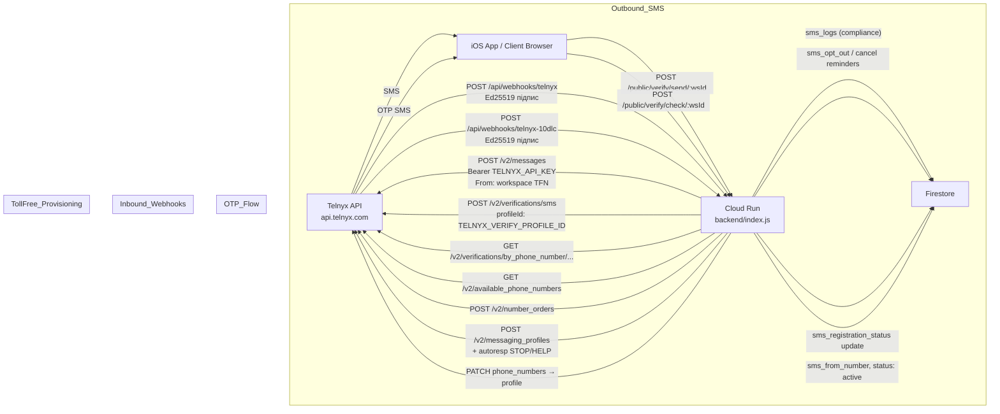

# Telnyx Integration Plan — Hardening & P0 Fixes

> [[Home]] > Tasks | Owner: AI 1 (Backend)
> Related: [[Messaging-System-AI1]], [[Tasks/SMS Finalization Plan|SMS Finalization Plan]], [[Tasks/SMS-Strategy-Review|SMS Strategy Review]], [[Tasks/Platform-Sender-Pivot-Decision|Platform Sender Pivot Decision]]
> Created: 2026-04-14 · Last reviewed: 2026-04-15

---

## Status — 2026-04-15

| Gap | Status | Notes |
|-----|--------|-------|
| Gap 1 — `TELNYX_VERIFY_PROFILE_ID` wiring | 🔴 **BLOCKED** (external) | Telnyx account requires `whitelisted_destinations for call settings`; fallback path works; needs Jonathan call |
| Gap 2 — Webhook signature verification | 🟡 **CODE DONE** · enforcing gated on secret | `verifyTelnyxWebhookSignature()` implemented in backend/index.js. No-op until `TELNYX_WEBHOOK_PUBLIC_KEY` is added to GitHub Secrets and wired through deploy-backend.yml |
| Gap 3 — `phone_number_index` + O(1) STOP lookup | ✅ **DONE** | Writes from both toll-free and 10DLC paths; reader uses single-doc lookup + `collectionGroup('clients')` for opt-out propagation |
| Gap 4 — `runAutoReminders()` pagination | ✅ **DONE** | `startAfter` pagination loop; no workspace cap |
| Gap 5 — Auto-provision on plan activation | ✅ **DONE** | `autoProvisionSmsOnActivation()` + `runSmsAutoProvisionRetry()` + wired into signup / Stripe / Apple paths with exponential backoff and `failed_max_retries` terminal state |

See `docs/DevLog/2026-04-15.md` → "Telnyx Hardening — Backend Gaps 2, 3, 4, 5" for full implementation detail.

---

---

## Scope of this document

Це **безпечний hardening plan**, який НЕ змінює sender архітектуру.

Consensus трьох AI (Claude / Codex / Verdent) на 2026-04-15:
- ✅ Технічні P0 нижче — робимо зараз, ризик низький
- ❌ Платформний `TELNYX_FROM` на всіх workspace — **не в цьому документі**; див. [[Tasks/Platform-Sender-Pivot-Decision|Platform Sender Pivot Decision]]

Sender architecture залишається **dual-path**:
- Нові workspace → per-workspace toll-free через `enable-tollfree`
- Grandfathered → manual 10DLC (Element Barbershop протектований)
- Якщо SMS не active → email-only fallback

---

## Поточний стан — що вже працює

| Компонент | Стан | Деталі |
|---|---|---|
| `TELNYX_API_KEY` | ✅ в GitHub Secrets | Деплоїться на Cloud Run через CI/CD workflow |
| `TELNYX_FROM` | ✅ в GitHub Secrets | Глобальний fallback номер |
| `TELNYX_VERIFY_PROFILE_ID` | ⚠️ Secret є, значення невідоме | Якщо порожнє — OTP іде через fallback (Firestore код) |
| `TELNYX_WEBHOOK_PUBLIC_KEY` | ❌ відсутній | Не в secrets, не в workflow — webhook підписи не верифікуються |
| `sendSms()` | ✅ | `POST api.telnyx.com/v2/messages` Bearer auth |
| `telnyxApi()` | ✅ | Generic REST helper для provisioning |
| `POST /api/sms/enable-tollfree` | ✅ | Автоматичний toll-free provisioning |
| `POST /api/sms/register` + `verify-otp` | ✅ | Grandfathered 10DLC шлях (Element) |
| `POST /api/webhooks/telnyx` | ✅ код є, ❌ підпис не верифікується | STOP/HELP compliance |
| `POST /api/webhooks/telnyx-10dlc` | ✅ код є, ❌ підпис не верифікується | Brand/campaign status updates |
| `runAutoReminders()` | ✅ | Кожні 3 хвилини, але ⚠️ cap 100 workspaces |

**Порівняння:** Stripe і Square вже мають webhook signature verification (`backend/index.js` ~1495, ~7492, ~10125). Telnyx — ні.

---

## Архітектура потоків



---

## Gap 1 — Перевірити TELNYX_VERIFY_PROFILE_ID (P0)

### Проблема
Secret `TELNYX_VERIFY_PROFILE_ID` визначено в GitHub Secrets і передається на Cloud Run, але невідомо чи він заповнений реальним значенням.

Якщо порожній — `POST /public/verify/send/:wsId` іде через fallback:
- Генерує 6-значний код локально
- Зберігає в `workspaces/{wsId}/phone_verify`
- Відправляє через `sendSms()` з глобального `TELNYX_FROM`

### Як перевірити
Відкрити Cloud Run → Edit → Variables → знайти `TELNYX_VERIFY_PROFILE_ID` — чи є значення.

Або перевірити через admin endpoint: `GET /api/vurium-dev/sms-admin-status` → поле `verify_profile_configured`.

### Як виправити (якщо порожній)
1. Відкрити [portal.telnyx.com](https://portal.telnyx.com) → **Verify → Verify Profiles → Create**
2. Назва: `VuriumBook OTP`
3. Тип: SMS
4. Default message: `Your VuriumBook verification code is: {code}`
5. Code length: 6, Expiry: 600 секунд
6. Зберегти **Profile ID**
7. Додати в GitHub Secrets: `TELNYX_VERIFY_PROFILE_ID = <profile-id>`
8. Задеплоїти → CI/CD автоматично передасть на Cloud Run

### Код в backend (вже є, нічого міняти не треба)
`backend/index.js` ~line 8604 — `POST /public/verify/send/:wsId`:
```
if (process.env.TELNYX_VERIFY_PROFILE_ID) {
  → POST api.telnyx.com/v2/verifications/sms
} else {
  → fallback: Firestore + sendSms()
}
```

---

## Gap 2 — Webhook Signature Verification (P0 — Security)

### Проблема
`POST /api/webhooks/telnyx` і `POST /api/webhooks/telnyx-10dlc` приймають будь-який POST як валідний.

Порівняти: Square (~line 1495) і Stripe (~line 10125) вже мають HMAC verification. Telnyx — ні.

Telnyx підписує кожен webhook заголовком `telnyx-signature-ed25519` (Ed25519/публічний ключ).

### Що зробити

**Крок 1:** Взяти публічний ключ у Telnyx:
- [portal.telnyx.com](https://portal.telnyx.com) → **Auth → Webhooks** → Public Key (формат base64 DER)

**Крок 2:** Додати в GitHub Secrets: `TELNYX_WEBHOOK_PUBLIC_KEY = <base64-key>`

**Крок 3:** Додати до `.github/workflows/deploy.yml` (разом з іншими Telnyx env vars):
```
--set-env-vars "TELNYX_WEBHOOK_PUBLIC_KEY=${{ secrets.TELNYX_WEBHOOK_PUBLIC_KEY }}" \
```

**Крок 4:** В `backend/index.js` додати helper функцію (використовує вбудований `crypto` Node.js):

```javascript
// Telnyx Ed25519 webhook signature verification
// Аналог verifyStripeSignature() яка вже є в коді
function verifyTelnyxWebhookSignature(req) {
  const publicKey = process.env.TELNYX_WEBHOOK_PUBLIC_KEY;
  if (!publicKey) return; // dev mode — не блокувати якщо ключ не заданий
  const sig = req.headers['telnyx-signature-ed25519'];
  const ts  = req.headers['telnyx-timestamp'];
  if (!sig || !ts) {
    const err = new Error('Missing Telnyx webhook signature');
    err.statusCode = 401;
    throw err;
  }
  try {
    const msgBuf = Buffer.from(`${ts}|${JSON.stringify(req.body)}`);
    const pubBuf = Buffer.from(publicKey, 'base64');
    const sigBuf = Buffer.from(sig, 'base64');
    const ok = crypto.verify(null, msgBuf,
      { key: pubBuf, format: 'der', type: 'spki' },
      sigBuf
    );
    if (!ok) throw new Error('Signature mismatch');
  } catch (e) {
    const err = new Error('Invalid Telnyx webhook signature');
    err.statusCode = 401;
    throw err;
  }
}
```

**Крок 5:** Викликати першим рядком в обох handlers:
- `POST /api/webhooks/telnyx` (~line 1718): перший рядок після `try {` → `verifyTelnyxWebhookSignature(req);`
- `POST /api/webhooks/telnyx-10dlc` (~line 1783): те саме

---

## Gap 3 — Inbound Webhook O(N) Scan (P2)

### Проблема
`POST /api/webhooks/telnyx` при кожному вхідному SMS (STOP/HELP) робить `db.collection('workspaces').limit(100).get()` + `cfg.get()` для кожного workspace — O(N) Firestore reads.

При 50 workspaces = 51 reads на кожен STOP SMS.

### Рішення
Додати Firestore колекцію `phone_number_index`:

```
phone_number_index/{e164_number}:
  workspace_id: string
  shop_name:    string
  from_number:  string
  updated_at:   ISO string
```

- **Записувати:** в `provisionTollFreeSmsForWorkspace()` після успішного `sms_from_number` запису
- **Читати:** в `POST /api/webhooks/telnyx` замість workspace scan:
  ```javascript
  const idxDoc = await db.collection('phone_number_index').doc(toNumber).get();
  // → O(1) замість O(N)
  ```

---

## Gap 4 — runAutoReminders workspace cap (P2)

### Проблема
`runAutoReminders()` (~line 8960) читає `db.collection('workspaces').limit(100)` — при >100 workspaces нагадування для решти не відправляються.

### Рішення (варіант A — швидкий)
Замінити `limit(100)` на пагінацію з `startAfter(lastDoc)`:
```javascript
let lastDoc = null;
do {
  let q = db.collection('workspaces').limit(50);
  if (lastDoc) q = q.startAfter(lastDoc);
  const snap = await q.get();
  // обробити snap.docs...
  lastDoc = snap.docs[snap.docs.length - 1];
} while (lastDoc && snap.docs.length === 50);
```

### Рішення (варіант B — правильний, після стабілізації)
Перенести job на Cloud Scheduler → `POST /internal/jobs/reminders` захищений `X-Internal-Secret` header.

---

## Gap 5 — Auto-provision toll-free on plan activation (P1 — UX)

### Проблема
Нині власник повинен явно зайти в `Settings → SMS Notifications` і натиснути `Enable SMS` щоб отримати toll-free номер. Це і є та єдина реальна UX-різниця між нами і Booksy — у Booksy SMS "просто працює" одразу після оплати.

### Рішення (низький ризик — не змінює sender model)
Автоматично викликати `provisionTollFreeSmsForWorkspace(wsId)` у двох точках:

1. **При успішній активації платного плану:**
   - Stripe webhook `invoice.payment_succeeded` → після `billing_status: 'active'`
   - Apple IAP verify → після успішного `/api/billing/apple-verify`
   - Trial → paid upgrade path
2. **При завершенні онбордингу** (на старті trial) для нових workspace, які обрали платний план

### Гарантії
- Тільки для нових workspace (перевірка `sms_registration_status` — якщо вже є `active` або `pending` — пропускаємо)
- Element Barbershop та інші grandfathered workspace **не зачіпаються** (перевірка через `isProtectedLegacyWorkspace()` і `isLegacyManualSmsPath()`)
- Якщо provisioning провалився → не блокуємо активацію плану, workspace просто залишається на email-only fallback; owner може вручну retry в Settings
- Audit log запис про auto-provision

### Що залишається таке саме
- Sender model — все ще per-workspace TFN
- Consent text — все ще `{shopName} Appointment Notifications`
- STOP isolation — кожен workspace зі своїм TFN має свій opt-out pool
- Compliance — без змін
- `Settings → SMS Notifications` — власник все ще бачить свій стан і може вручну activate/retry, але вже у більшості випадків бачить `Configured` без кліку

### Де в коді
- `backend/index.js` ~ Stripe webhook `invoice.payment_succeeded` handler
- `backend/index.js` ~ `/api/billing/apple-verify`
- `backend/index.js` ~ `provisionTollFreeSmsForWorkspace()` (використати як є)

### DoD
- [ ] Новий trial workspace з платним планом отримує toll-free без кліку
- [ ] Element Barbershop та legacy workspaces не зачіпаються
- [ ] Auto-provision failure не ламає billing flow
- [ ] `audit_logs` має запис `sms_auto_provisioned`
- [ ] Оновлена `docs/Features/SMS & 10DLC.md` секція

---

## Що НЕ міняємо

| Компонент | Чому |
|---|---|
| `Element Barbershop` workspace | Захищений — pending manual 10DLC review, без змін |
| `POST /api/sms/register` | Grandfathered 10DLC шлях залишається |
| `POST /public/verify/send/:wsId` | Публічний контракт — сигнатура не змінюється |
| `POST /public/verify/check/:wsId` | Те саме |
| Toll-free provisioning flow | Вже працює, тільки Verify Profile треба |
| **Sender architecture (per-workspace TFN)** | Платформний sender — окреме рішення, див. [[Tasks/Platform-Sender-Pivot-Decision]] |

---

## CI/CD env vars — повний список Telnyx

У `.github/workflows/deploy.yml` вже є:
```yaml
--set-env-vars "TELNYX_API_KEY=${{ secrets.TELNYX_API_KEY }}"
--set-env-vars "TELNYX_FROM=${{ secrets.TELNYX_FROM }}"
--set-env-vars "TELNYX_VERIFY_PROFILE_ID=${{ secrets.TELNYX_VERIFY_PROFILE_ID }}"
```

Треба додати:
```yaml
--set-env-vars "TELNYX_WEBHOOK_PUBLIC_KEY=${{ secrets.TELNYX_WEBHOOK_PUBLIC_KEY }}"
```

GitHub Secrets які повинні бути заповнені:

| Secret | Де взяти | Статус |
|---|---|---|
| `TELNYX_API_KEY` | portal.telnyx.com → Auth → API Keys | ✅ є в secrets |
| `TELNYX_FROM` | Глобальний fallback TFN або залишити | ✅ є в secrets |
| `TELNYX_VERIFY_PROFILE_ID` | portal.telnyx.com → Verify → Profiles | ⚠️ перевірити значення |
| `TELNYX_WEBHOOK_PUBLIC_KEY` | portal.telnyx.com → Auth → Webhooks → Public Key | ❌ додати |

---

## Тест-план після імплементації

### OTP
```
POST /public/verify/send/:wsId  { "phone": "+13121234567" }
→ SMS з кодом на телефон (через Telnyx Verify, не fallback)
POST /public/verify/check/:wsId { "phone": "+13121234567", "code": "123456" }
→ { ok: true }
```
Перевірити: `GET /api/vurium-dev/sms-admin-status` → `verify_profile_configured: true`

### Webhook signature
```
POST /api/webhooks/telnyx  (без заголовків підпису)
→ 401

POST /api/webhooks/telnyx  (з валідним Ed25519 підписом)
→ 200
```

### STOP compliance
```
Надіслати "STOP" SMS на workspace TFN
→ Webhook → client.sms_opt_out = true
→ sms_reminders для цього номера помічені sent=true
→ Відповідне SMS назад клієнту
```

### Toll-free provisioning
```
POST /api/sms/enable-tollfree  (Owner JWT, новий workspace)
→ { ok: true, number: "+1800..." }
→ Firestore: sms_registration_status === 'active'
→ sms_from_number заповнений
```

### Reminder flow
```
Створити booking → sms_reminders записи з'являються
Почекати 3 хвилини → runAutoReminders() відправляє SMS
sms_logs (top-level) → запис з'явився
```

---

## DoD — коли Telnyx вважається повністю підключеним

- [ ] `TELNYX_VERIFY_PROFILE_ID` заповнений, OTP іде через Telnyx Verify API
- [ ] `TELNYX_WEBHOOK_PUBLIC_KEY` в secrets, webhook signature verification активна
- [ ] Обидва webhook endpoints повертають 401 без підпису
- [ ] Toll-free provisioning відпрацьовує для нового workspace
- [ ] Reminders відправляються з workspace TFN (не з глобального fallback)
- [ ] Element Barbershop — на manual шляху, без змін
- [ ] `sms_logs` зберігають compliance trail для кожного відправленого SMS
